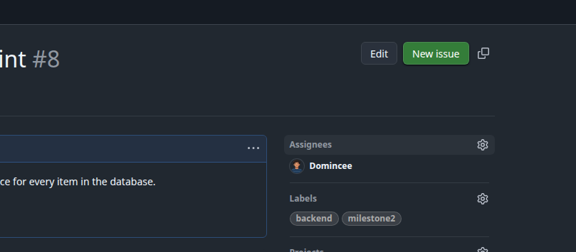
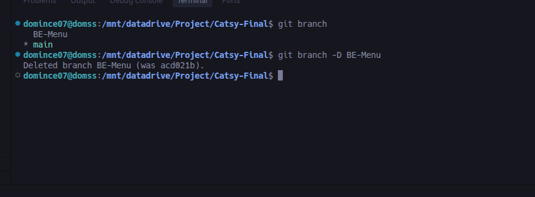

# 🚀 TEAM WORKFLOW GUIDE (START HERE!)

Welcome! Please read this carefully to ensure we all work together smoothly without losing any code.

---

## 🌳 BRANCH STRATEGY
Our team uses two main branches. Please understand the difference:
- **`main` (Development):** This is where all active team development happens. When you finish a feature, you will **always** create a Pull Request to merge your code here.
- **`production` (Stable/Deployed):** This is the live, working project. 🛑 **Never branch off of or merge directly into `production`.** We only update `production` when `main` is perfectly stable and ready to release.

---

### 🛑 VERY IMPORTANT: ALWAYS UPDATE FIRST!
Before you start any work, **always** make sure your code is up-to-date with the rest of the team:
1. Open your terminal and type: `git checkout main`
2. Then type: `git pull`
*(This prevents overlapping work and conflicts later!)*

---

## 📋 STEP-BY-STEP WORKFLOW

### Step 1: Claim an Issue
Find an issue on the GitHub board that you want to work on and assign it to yourself.

### Step 2: Create a New Branch
**Never work directly on the `main` branch!** Create a branch specifically for your issue.

### Step 3: Do Your Work
Read the task requirements on the issue board, write your code, and test your work.

### Step 4: Save and Push Your Work
When you are done saving files in your code editor, you need to save them in Git:
1. **Stage all changes:** `git add .`
2. **Commit changes:** `git commit -m "Your Commit Message"` 
   *(⚠️ **CRITICAL:** Your commit message **MUST** be the exact title of the GitHub Issue, including the # number!)*
3. **Push to GitHub:** 
   - For your **first push** on a new branch, you **MUST** use: `git push -u origin <your-branch-name>`
   - For **all future pushes** on that same branch, just use: `git push`

> **Important Note on PRs:** The "Compare & pull request" button will appear on the GitHub web page every time you push new commits to a branch. 
> 🛑 **DO NOT click it until you are 100% finished with your issue and ready for review!** If the button disappears, you can always open a PR manually from the "Pull requests" tab.

**Push Examples:**

### Step 5: Provide Proof of Work
Go to your chosen Issue on GitHub and add a comment with an image, video, or description proving that your task is complete and working.

### Step 6: Close the Issue
Once your proof is uploaded, click to close the issue as "Completed".

### Step 7: Request a Code Review (Pull Request)
Go to the main Repository page on GitHub. You should see a green button to create a **Pull Request (PR)**. This asks the team to review your code before it merges into the `main` branch.

### Step 8: Wait for Review!
Take a break! Wait for your team to review and approve your Pull Request. 

### Step 9: Clean Up (Delete Branch)
Once your Pull Request is approved and merged into `main` on GitHub, you are officially finished with the task! Now clean up your local computer:

1. Switch back to main: `git checkout main`
2. Download the newly merged code: `git pull`
3. Delete your old branch: `git branch -D <your-branch-name>`

**🎉 You are now ready to grab a new issue and start again from Step 1!**