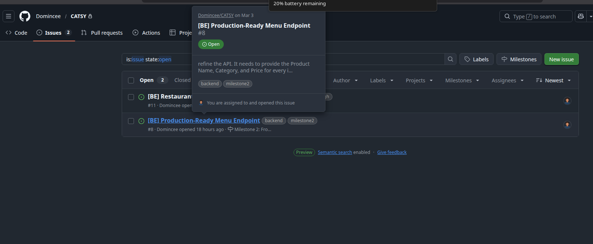

## HOW TO WORK WITH TEAM
# FOLLOW THIS STEPS

1. select any issue to Work

2. Create new branch for that issue to work

3. Do your work(Read task on board(Issue))

4. Add . , Commit (copy amd paste the title of the issue Must include the number) & Push your work
FOLLOW THIS STEPS:

---only do push -u origin if u are ready to push it to main branch
---then do only git push to push on current branch
ex.

--Button Compare and Pull request will not show 

5. Go to Issue & Add Comment proving the task is done (image or description):

6. Close the Issue (Completed)

6. Go back to Repository and Request PR (pull request)

7. WAIT for review and accepted

8. Once u see the changes is now pull on main ,delete branch or manualy dete from terminal
Follow this steps:
Ensure u are on the main 

9. Once on main , pull the changes

--ensure all changes are pull before doing any work